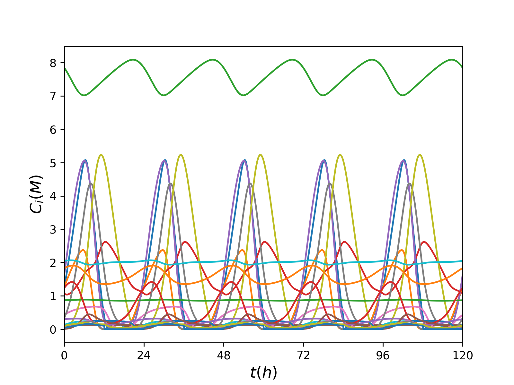

### PhD Projects

#### Neural Networks learning how bacteria move and coordinate  
Chemotaxis is the ability of bacteria to direct multicellular motion along chemical gradients. This phenomenon is central to environmental, medical and agricultural processes [1]. For this project, I trained Neural Networks (and Gaussian Processes) that *learn* Chemotactic PDEs, and when integrated, can **reproduce and predict bacterial density profiles**. This has been done in the following cases:
  * Black-box PDE models
  * Gray-box PDE models (closures)
  * Partial information - second order models  
  
And with many kinds of datasets:
  * Data from PDE simulations 
  * Data from Monte-Carlo simulations (agent-based models)
  * Sparse, Noisy experimental data

**Fig.1** : The Data-driven PDE is able to reproduce the bacteria density profiles beyond the training set and predict new trajectories. 

**Fig.2** : Data-driven PDEs can be trained on experimental data. Here the Neural Network 'learns' and reproduces what is seen in the microscope. 

**Publications:**
[Psarellis et al., 2022](https://arxiv.org/pdf/2208.11853.pdf)
[Lee, Psarellis et al., 2023](https://link.springer.com/article/10.1007/s00285-023-01946-0)

[1]  [Bhattacharjee et al., 2020](https://www.sciencedirect.com/science/article/pii/S0006349521004276)

#### Programming Dynamic Catalysts with Bayesian Optimization
Improved catalytic performance can lead to breakthroughs in sustainability, e.g. low-cost solar and wind power. However, catalysts are naturally limited by the [Sabatier principle](https://en.wikipedia.org/wiki/Sabatier_principle). By imposing an (appropriately tuned) electrodynamic oscillation on the catalytic surface, the Sabatier principle can be overcome [2]. I used **advanced Numerical Methods** and **Machine Learning** to tune such catalysts. This included:
 * Root-finding accelerated by up to 150% using a Variational Approach.
 * Pseudo-arclength continuation used to explore the parameter space.
 * Bayesian Optimization employed to optimize reactor performance/reaction rates.

**Fig.3** : Dynamic Catalysts act like a molecular 'pump' overcoming the limitations of static catalysis.

**Fig.4** : Bayesian Optimization 'sculpts' a complex forcing function (red curve) to optimize the reactor's performance. 

 Project finished - two publication underway 

[2] [Ardagh et al., 2020](https://pubs.rsc.org/en/content/articlelanding/2020/sc/c9sc06140a)

* **Bayesian Continuation for Bayesian Optimization**

A research 'by-product' of Dynamic Catalysis: Initializing Black-box simulations using Machine Learning surrogate models. 

 Project finished - one publication underway 

* **Investigating the response of Circadian Rhythmicity to drugs**

Circadian rhythm is central to many physiological, mental and behavioral processes in all mammals. I study one of the most advanced/ established computational biology models of the suprachiasmatic nucleus, the neurons of which oscillate to produce the circadian rhythm [3]. 
   * Using Matrix-free numerical methods, I explore periodic solutions of a 8925-dimensional dynamical system. 
   * I investigate how the drug [Longdaysin](https://www.medchemexpress.com/longdaysin.html) affects the limits of entrainment.
   * I employ Unsupervised learning to cluster/parametrize the neurons and find out what sets them apart.

**Fig.5** : Example of Crcadian Oscillations for one circadian neuron in the Suprachriacmatic Nucleus.

 Project under completion 

[3] [Vasalou et al., 2011](https://www.sciencedirect.com/science/article/pii/S0006349511005613)

* **Directed Graph Embeddings**

Directed Graphs arise naturally in applications ranging from chemical reaction networks to social networks and IoT. Here, I investigate mappings to(/from) lower-dimensional descriptions with unsupervised learning and interpret the new sets of data-driven coordinates.

**Fig.6** : A two-scale potential energy surface giving rise to a Directed Graph of transition probabilities. This graph is reducible to one-dimension.

 Project under completion 

* **Neural Network Pathologies**

Using Neural Networks to approximate the dynamics of nonlinear systems can lead to qualitatively different attractors. I verify and investigate such pathologies.

 Project under completion 

* **Machine Learning for PDEs with Complex Geometries**

I try to map PDE solutions to the geometries of their domain boundaries. This can be used to accelerate simulations of the Electrophysiology of the heart.

 Project under completion 

### Personal Projects/ Code samples

* **BrainSeq** 
This is my first personal project and exploration. I am trying to uncover patterns in a number sequences provided by Jenny (a friend). I demonstrate tools and algorithms from statistics and probability for testing my friend's brain as a random number generator. 

* **NKGMRES**
This is a code sample for an advanced solver for high-dimensional, nonlinear systems of equations.

