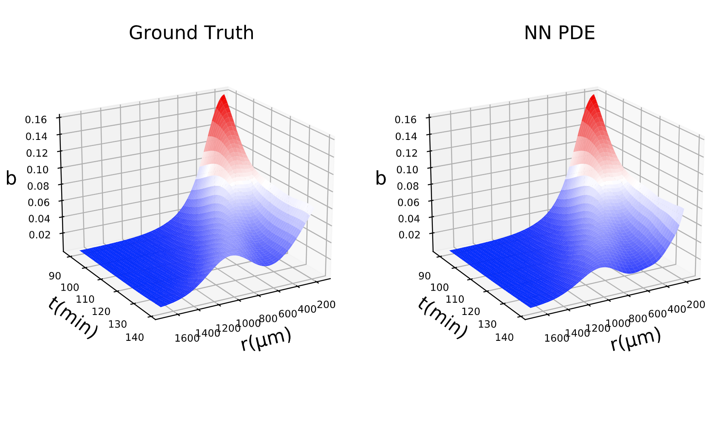
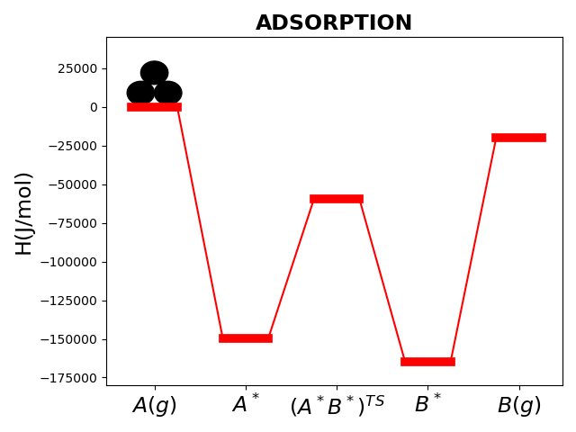
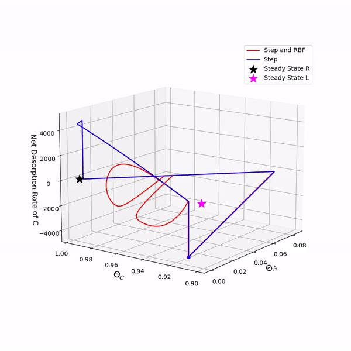

### PhD Projects

#### 1) Neural Networks learning how bacteria move and coordinate  
Chemotaxis is the ability of bacteria to direct multicellular motion along chemical gradients. This phenomenon is central to environmental, medical and agricultural processes [1]. For this project, I trained Neural Networks (and Gaussian Processes) that *learn* Chemotactic PDEs, and when integrated, can **reproduce and predict bacterial density profiles**. This has been done in the following cases:
  * Black-box PDE models
  * Gray-box PDE models (closures)
  * Partial information - second order models  
  
And with many kinds of datasets:
  * Data from PDE simulations 
  * Data from Monte-Carlo simulations (agent-based models)
  * Sparse, Noisy experimental data

**Fig.1** : The Data-driven PDE is able to reproduce the bacteria density profiles beyond the training set and predict new trajectories. 

**Fig.2** : Data-driven PDEs can be trained on experimental data. Here the Neural Network 'learns' and reproduces what is seen in the microscope. 

**Publications:**
[Psarellis et al., 2022](https://arxiv.org/pdf/2208.11853.pdf)
[Lee, Psarellis et al., 2023](https://link.springer.com/article/10.1007/s00285-023-01946-0)

[1]  [Bhattacharjee et al., 2020](https://www.sciencedirect.com/science/article/pii/S0006349521004276)

#### 2) Investigating the response of Circadian Rhythmicity to drugs

Circadian rhythm is central to many physiological, mental and behavioral processes in all mammals. I study one of the most advanced/ established computational biology models of the suprachiasmatic nucleus, the neurons of which oscillate to produce the circadian rhythm [3]. 
   * Using Matrix-free numerical methods, I explore periodic solutions of a 8925-dimensional dynamical system. 
   * I investigate how the drug [Longdaysin](https://www.medchemexpress.com/longdaysin.html) affects the limits of entrainment.
   * I employ Unsupervised learning to cluster/parametrize the neurons and find out what sets them apart.

**Fig.5** : Example of realistic spatiotempotal circadian oscillations in the Suprachriacmatic Nucleus. The color here corresponds to the concentration of Per-mRNA.

**Publication**: [Psarellis et al., 2023](https://pubs.aip.org/aip/cha/article-abstract/33/1/013137/2877636/Limits-of-entrainment-of-circadian-neuronal)

[3] [Vasalou et al., 2011](https://www.sciencedirect.com/science/article/pii/S0006349511005613)

#### 3) Programming Dynamic Catalysts with Bayesian Optimization
Improved catalytic performance can lead to breakthroughs in sustainability, e.g. low-cost solar and wind power. However, catalysts are naturally limited by the [Sabatier principle](https://en.wikipedia.org/wiki/Sabatier_principle). By imposing an (appropriately tuned) electrodynamic oscillation on the catalytic surface, the Sabatier principle can be overcome [2]. I used **advanced Numerical Methods** and **Machine Learning** to tune such catalysts. This included:
 * Root-finding accelerated by up to 150% using a Variational Approach.
 * Pseudo-arclength continuation used to explore the parameter space.
 * Bayesian Optimization employed to optimize reactor performance/reaction rates.
 * Bayesian Continuation (introduced here) to learn the solution manifold of the reactor.

**Fig.3** : Dynamic Catalysts act like a molecular 'pump' overcoming the limitations of static catalysis.

**Fig.4** : Bayesian Optimization 'sculpts' a complex forcing function (red curve) to optimize the reactor's performance. 

**Publication**: [Psarellis et al., 2023](https://pubs.acs.org/doi/abs/10.1021/acscatal.3c00864)

[2] [Ardagh et al., 2020](https://pubs.rsc.org/en/content/articlelanding/2020/sc/c9sc06140a)

#### 4) Searching for rare events in Chemistry and Biology

Rare events in chemistry and biology often translate to catastrophic phenomena. Their discovery is important not only for deeper understanding of the underlying dynamics, but also for safe engineering design and therapeutic interventions. In this work I used methods Bayesian Optimization to locate such points with active sampling. Some highlights include:

* Uncertainty quantification of rare events.
* Parsimonious/smart/active sampling.
* No equations/model needed (black-box observable), therefore readily applied to experiments.

#### 5) Bayesian Continuation for Bayesian Optimization

A research 'by-product' of Dynamic Catalysis: Initializing Black-box simulations using Machine Learning surrogate models. This algorithms also enables higher-order, machine-learning enabled numerical continuation. 

#### 6) Directed Graph Embeddings

Directed Graphs arise naturally in applications ranging from chemical reaction networks to social networks and IoT. Here, I investigate mappings to(/from) lower-dimensional descriptions with unsupervised learning and interpret the new sets of data-driven coordinates.

**Fig.6** : A two-scale potential energy surface giving rise to a Directed Graph of transition probabilities. This graph is reducible to one-dimension.

#### 7) Neural Network Pathologies

Using Neural Networks to approximate the dynamics of nonlinear systems can lead to qualitatively different attractors. I verify and investigate such pathologies, using (and designing) invertible Neural Network architectures.

#### 8) Emergent spaces for cell biomarkers

In the recent era of overwhelmingly many single-cell data, advanced unsupervised learning techniques are employed to find out:

* How many nonlinear descriptors are important when studying a large number of motility/morphology/biochemical features.
* Which features describe the **same** underlying processes.
* Which features have predictive power when it comes to a disease related outcome, such as aging- or pathogen-related

