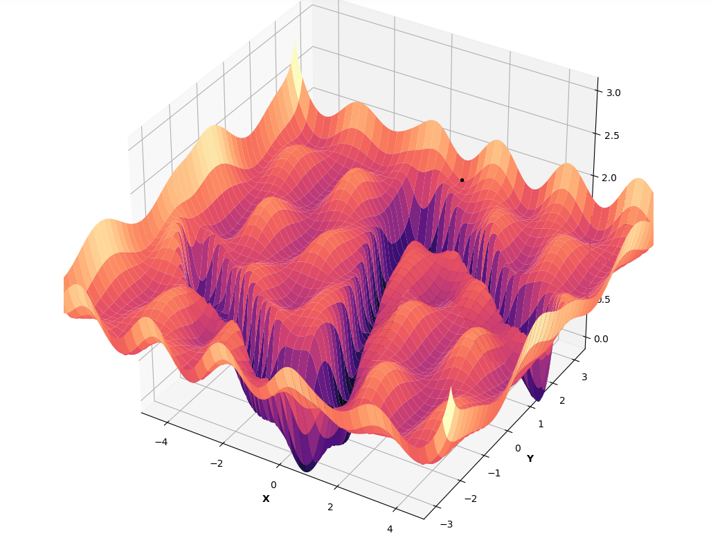
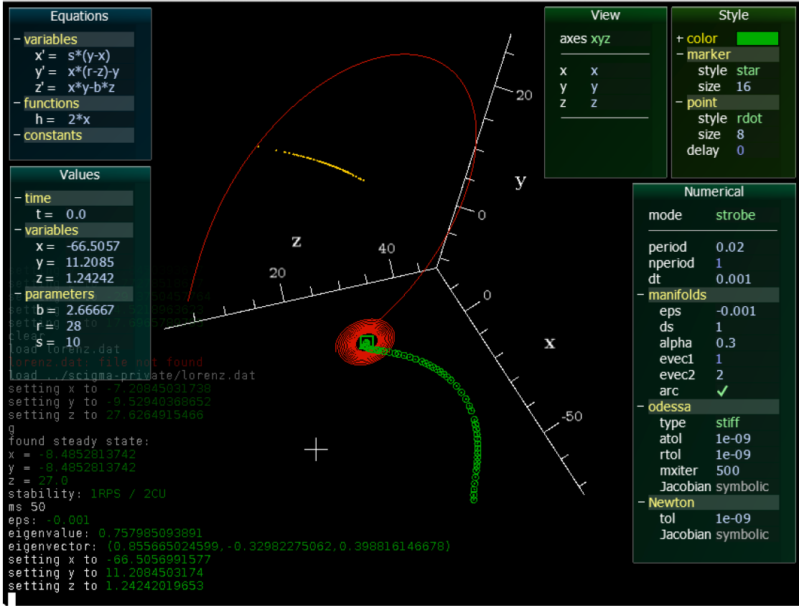

# Yorgos Psarellis
#### Machine Learning Scientist
#### PhD Candidate @ JHU

I'm interested in Computational Research that helps people. 
I've worked on problems in Artificial Intelligence, Manifold Learning, Probability Theory, Biology, Biomedical engineering and Catalysis. Check out my [CV](CV_Psarellis.pdf) for more a summary of my academic journey.

#### Research



#### [Teaching](Teaching.md)



#### Personal


Contact Information


<!--```

For more details see [Basic writing and formatting syntax](https://docs.github.com/en/github/writing-on-github/getting-started-with-writing-and-formatting-on-github/basic-writing-and-formatting-syntax).

### Jekyll Themes

Your Pages site will use the layout and styles from the Jekyll theme you have selected in your [repository settings](https://github.com/YorgosPs/ypsarellis/settings/pages). The name of this theme is saved in the Jekyll `_config.yml` configuration file.

### Support or Contact

Having trouble with Pages? Check out our [documentation](https://docs.github.com/categories/github-pages-basics/) or [contact support](https://support.github.com/contact) and we’ll help you sort it out.-->
